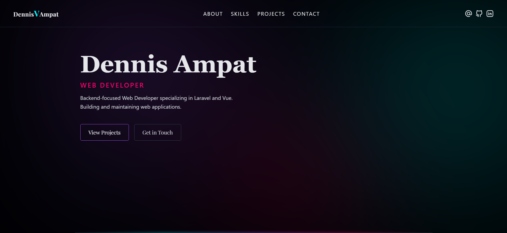

# My Portfolio



A portfolio template featuring a dark neon-inspired design, built with Vue and Tailwind CSS.
This can be used as a base for your own portfolio, with optional attribution to Dennis Ampat through a credit or link back to this repository.

## Tech Stack

- Vue
- Vue Router
- Pinia
- Tailwind CSS

## Theme Colors
``` css
  --neon-cyan: #00f5ff;
  --neon-pink: #ff006e;
  --neon-purple: #a855f7;
  --neon-green: #00ff88;
  --bg-deep: #020617;
```

## Recommended IDE Setup

[VS Code](https://code.visualstudio.com/) + [Vue (Official)](https://marketplace.visualstudio.com/items?itemName=Vue.volar) (and disable Vetur).

## Customize configuration

See [Vite Configuration Reference](https://vite.dev/config/).

## Project Setup

```sh
npm install
```

### Compile and Hot-Reload for Development

```sh
npm run dev
```

### Compile and Minify for Production

```sh
npm run build
```

## Add or edit Experience - About Section

- Navigate to `/src/components/sections/About.vue`

Update the `experiences` array.
You can also change pills or make it empty.

## Add or edit Skills

- Navigate to `/src/components/sections/Skills.vue`

Update the `skills` array.  
Do not change existing keys.

## Add or edit Projects

- Navigate to `/src/stores/index.js`

Update the `project_list` array.  
Do not change existing keys.

### Rules
- `slug` must match the folder name in:
  assets/images/projects/<slug> (case sensitive)

- Each image must define:
  images[].name → exact file name + extension (case sensitive)

- If no live link, you can comment the live_link key

### Example
```js
project_list: [
  {
    title: 'Example',
    slug: 'example',
    images: [
      {
        name: 'bytewebster.png',
        description: 'Landing',
      },
      {
        name: 'landmark.png',
        description: '',
      },
      {
        name: 'loople.png',
        description: '',
      },
      {
        name: 'envato.jpg',
        description: '',
      },
      {
        name: 'monst.jpg',
        description: '',
      },
    ],
    description: 'Lorem ipsum dolor sit amet consectetur, adipisicing elit. Aliquam, sapiente quae cumque beatae quam ipsum',
    about:
      `Lorem ipsum dolor sit amet consectetur, adipisicing elit. Aliquam, sapiente quae cumque beatae quam ipsum,
      nobis nam minima id reprehenderit sequi repellat eos, obcaecati dolorum sunt aut praesentium! Ea consequuntur
      asperiores recusandae natus dicta, ex, officia commodi, quisquam temporibus culpa voluptate neque.
      Totam sit accusamus, facere doloremque tempore sequi iure.`,
    key_features: [
      'Key Feature 1',
      'Key Feature 2',
      'Key Feature 3',
      'Key Feature 4',
      'Key Feature 5',
    ],
    tech_stack: [
      'Laravel',
      'Vue 3',
      'REST API',
      'MySQL',
    ],
    live_link: 'https://your.link'
  },
]
```

## To enable or disable deployment:
 
- Navigate to: **Settings → Secrets and variables → Actions → Variables**
- Add or edit a repository variable:

  Name: ENABLE_DEPLOY  
  Value: true or false  

### Notes
- Value must be a string: `true` or `false`  
- If not set, deployment will NOT run (default)
- If you are using other platforms (Vercel, Netlify, AWS, cPanel, etc.), you may disable the GitHub Pages workflow to avoid unnecessary builds.

## License

This project is licensed under the [MIT License](LICENSE).

Copyright (c) 2026 Dennis Ampat
